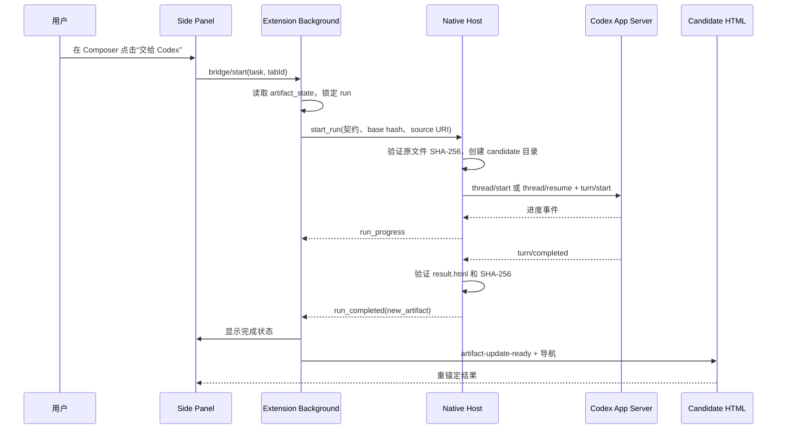

# v0.7 Codex Local Bridge 实现 Spec

> 日期：2026-07-18  
> 前置版本：v0.6.1 Change Contract、v0.6.2 Artifact Version Reconciliation 已完成。  
> 目标：让用户在 HTML Genius Side Panel 内把一份修改契约直接交给**用户本机已登录的 Codex**执行；Codex 只创建或续发 HTML Genius 自己创建的 thread，产出一个新的本地 HTML candidate，并由 v0.6.2 协议安全打开、重锚定批注。  
> 首发平台：**macOS + Chrome + Node.js 20+ + 可用的 Codex CLI/App Server**。不做跨平台兼容承诺。

## 0. 结论与版本边界

v0.7 不是在扩展中做一个聊天框，也不是 HTML Genius 代用户购买/转售模型 Token。它是一个个人本地控制面：Chrome extension 通过 Native Messaging 连到一个用户本机的 host，host 再通过 `codex app-server` 使用用户已有的 Codex 登录态。

本版只接 **Codex App Server**。Claude Code、Copilot、通用 adapter、MCP 均不进入本版。

**最重要的安全决策：v0.7 只写 candidate，不覆盖原文件。**

- `precise_patch` / `local_optimize`：Codex 在一个受控 candidate 目录中生成 `result.html`。
- `regenerate`：同样只生成 candidate，绝不覆盖原文件。
- `restructure`：契约本身要求只给计划，不启动 Bridge；继续沿用复制“规划任务”。
- 成功后 extension 导航至 candidate artifact，并复用 v0.6.2 的 `new_artifact` → `logical_document_id` → 重锚定流程。
- 原文件的 diff、验收和“确认提升为正式文件”属于 **v0.7.1**。不要在 v0.7 暗中添加覆盖原文件的快捷路径。

这个取舍比“点击即改原文件”多了一步查看，但保留了最关键的不变量：模型越界或失败时，用户的源 HTML 不会被破坏。它也避免把 prompt 当成唯一的写入边界。

## 1. 用户流程与成功定义



### 成功标准

1. 用户可在当前 v0.6.1 Composer 内直接发起 Codex 执行，不需要复制、切换到另一个应用再粘贴。
2. Bridge 使用用户本机 Codex 登录态；HTML Genius 不保存 API key、Token、ChatGPT 凭据或模型响应到远端。
3. 每次执行只会：创建一个新的 HTML Genius-owned Codex thread，或续发该逻辑文档上先前由 Bridge 创建并记录的**已完成** thread。
4. 不列出、不读取、不续发、不向任何外部/用户已有 Codex thread 注入消息；尤其不使用 `turn/steer`。
5. Bridge 启动前与结束后都校验完整 SHA-256；源 artifact 在启动后变化则不执行/不打开结果。
6. Codex 只在受控 candidate 目录写 `result.html`；原 artifact 的 byte hash 在整个 run 后仍须保持等于启动前 hash。
7. 成功结果通过 v0.6.2 的 `artifact-update-ready`，以 `new_artifact` 打开；批注按现有 TextQuote anchor 重定位为 `open` / `stale`。
8. Bridge 未安装、Codex 未就绪、用户未登录、turn 失败、超时、源文件发生变化、candidate 不存在或 hash 不符时，必须停止并给可操作的错误；不得降级为“看似成功”。

## 2. 适用范围与非目标

### 2.1 v0.7 支持的 artifact

仅支持：

- 当前页面是 v0.6.2 managed local artifact（`file:` 或 localhost 的 HTML）；
- 当前 artifact 有 `logical_document_id` 与 `loaded_artifact_hash`；
- 单文件、可独立打开的 HTML（inline CSS/JS 或绝对 URL 资源）。

不支持相对资源依赖复杂的多文件站点。candidate 位于独立目录，若页面依赖 `./styles.css`、`./img/*` 等相对资源，结果很可能失真。UI 必须在启动前显示此限制。多文件 project/worktree 模式属于未来 adapter / v0.8，不要在本版假装处理。

### 2.2 明确不做

- Claude Code、Copilot、任意 agent adapter、MCP task pull。
- 扫描、选择或接管 Codex Desktop/CLI 中已有 thread。
- `thread/list`、`thread/read` 用于发现用户历史；也不使用 `thread/inject_items` 或 `turn/steer`。
- 在 Side Panel 展示完整 Agent 对话或提供 HTML Genius 自有 AI Chat。
- 覆盖原文件、自动 apply candidate、文本 diff/DOM diff、逐项接受变更。
- 远端网页、协同模式、server API、登录系统、第三方云服务。
- 在 extension 内保存 Codex credential、Token、Cookie，或通过网络上传页面/批注。
- 运行中的任务取消、任务队列、并行多任务、后台常驻 daemon。一个 tab 同时只允许一个 run。
- Windows/Linux 的 Native Host 注册与安装。

## 3. 官方协议依据与兼容性门槛

Codex App Server 是一个基于 stdio 的 JSON-RPC 服务；连接后必须先 `initialize` 再 `initialized`。它支持 `thread/start` 创建新对话、`thread/resume` 继续已记录的 thread，以及 `turn/start` 发起一个工作单元；turn 结束以事件流中的终态事件判断。官方文档也明确说明，应记录并用 `thread.id` 恢复 stored session，而不是自己推导 session id。[Codex App Server](https://developers.openai.com/codex/app-server/)

实现不得把文档示例中的字段形状写死为永久协议。App Server 版本会演进，host 首次自检必须：

1. 执行 `codex app-server generate-json-schema --out <temporary-dir>`；
2. 检查 schema 中存在 `initialize`、`thread/start`、`thread/resume`、`turn/start` 及 `turn/completed` 的事件定义；
3. 启动一个只读 smoke connection，完成 initialize handshake；
4. 任一步不通过即将 Bridge 状态设为 `incompatible`，禁止执行，并在 UI 提示升级 Codex CLI。

不要把当前机器若出现的旧 CLI 或不支持 `--out` 的行为视为可兼容；这是明确阻断条件，不是 fallback 到 undocumented CLI 命令的理由。

## 4. 架构

### 4.1 组件职责

| 组件 | 职责 | 绝不负责 |
|---|---|---|
| Side Panel | 选择“新任务/继续本页面 Bridge task”、展示状态和错误 | 启动 shell、读写本地文件、保存密钥 |
| Background service worker | Native port 生命周期、run 路由、tab 锁、向 content script 转发 v0.6.2 completion | 解析/执行 Codex JSON-RPC、绕过 base hash 校验 |
| Content script | 提供当前 `artifact_state`，接收既有 `artifact-update-ready` 并重锚定 | 直接连接 Native Host、直接写文件 |
| Native Host | Chrome Native Messaging framing、文件路径/哈希验证、candidate 目录、App Server child process 与事件转换 | 接受任意 shell command、访问浏览器会话或外部 Codex thread |
| Codex App Server | 以用户本机登录态执行由 Bridge 创建/恢复的 Codex thread | 知道 Chrome tab、直接控制扩展 |

### 4.2 本地目录

新增 `bridge/`，使用 Node.js ESM 与 Node 标准库，**禁止新增 npm runtime dependency**：

```text
bridge/
  package.json
  host.mjs                     # Native Messaging stdin/stdout 主进程
  native-protocol.mjs          # 4-byte length framed JSON codec
  app-server-client.mjs        # JSON-RPC child process client
  run-manager.mjs              # run 状态机、文件校验、candidate 创建
  prompt.mjs                   # 从 Change Contract task 生成 Codex 输入
  install-macos.mjs            # 仅安装/卸载 native host manifest
  bridge-host-manifest.json.template
  test/
    native-protocol.test.mjs
    app-server-client.test.mjs
    run-manager.test.mjs
    fake-app-server.mjs
```

Host 用户状态仅放在：`~/Library/Application Support/htmlGenius/bridge/`。保存的内容仅包括 host 安装信息和必要的 run crash recovery metadata；不保存 prompt、HTML 内容、Codex response 或任何 credential。

Chrome extension 的可持久化状态仍在其 IndexedDB；它是 bridge session ownership 的来源。

### 4.3 Native Messaging 安装

扩展 manifest 增加 `"nativeMessaging"` permission。Native host 名固定：`com.htmlgenius.codex_bridge`。

`npm run install:macos -- --extension-id <chrome-extension-id>` 必须：

1. 验证 Node >= 20、`codex` 在 PATH、当前 bridge 路径为绝对路径；
2. 生成 host manifest 到 Chrome macOS 的 NativeMessagingHosts 用户目录；
3. manifest 的 `allowed_origins` 只能包含传入的一个 `chrome-extension://<id>/`；
4. manifest 的 `path` 指向一个无 shell 拼接的 launcher；launcher 使用绝对 `node` 与绝对 `host.mjs`；
5. 打印实际路径与 uninstall 命令，但不自动修改 Chrome extension 配置；
6. 失败时清理半写入文件。

不可使用宽泛 origin、`externally_connectable` 或 localhost HTTP server 代替 Native Messaging。Native Host manifest 白名单是 extension → host 的第一层边界。

## 5. 数据模型

将 IndexedDB 升级到 `DB_VERSION = 3`，保留 v0.6.2 的所有 store 和数据。

### 5.1 `bridge_sessions`

keyPath：`logical_document_id`。

```js
{
  logical_document_id: "hgd_...",
  provider: "codex_app_server",
  ownership: "htmlgenius",
  thread_id: "thr_...",          // 仅 Bridge 通过 thread/start 获得后才写入
  cwd: "/absolute/source-directory",
  created_at: "ISO-8601",
  updated_at: "ISO-8601",
  last_turn_id: "turn_...",
  last_status: "completed" | "failed"
}
```

禁止提供按 `thread_id` 浏览或“导入 thread”的 public API。`getBridgeSession(logicalDocumentId)` 只能返回该逻辑文档的 record。

### 5.2 `bridge_runs`

keyPath：`run_id`；索引 `logical_document_id`（non-unique）、`tab_id`（non-unique）。

```js
{
  run_id: "hgr_...",
  logical_document_id: "hgd_...",
  tab_id: 123,
  source_artifact_uri: "file:///.../report.html",
  base_artifact_hash: "sha256:...",
  target_artifact_uri: "file:///.../.htmlgenius-candidates/hgr_.../result.html",
  mode: "precise_patch" | "local_optimize" | "regenerate",
  session_mode: "new" | "continue",
  thread_id: "thr_..." | null,
  turn_id: "turn_..." | null,
  status: "starting" | "running" | "completed" | "failed" | "conflict",
  created_at: "ISO-8601",
  completed_at: "ISO-8601" | null,
  error_code: "..." | null
}
```

不存完整 Change Contract、prompt、Agent 流式文本或 artifact 内容；这些数据在 run 结束后只保留用户已存在的 annotation / artifact version metadata。

新增 `Storage` API（均为纯数据访问）：

```js
getBridgeSession(logicalDocumentId)
saveBridgeSession(record)
getActiveBridgeRunForTab(tabId)
saveBridgeRun(record)
updateBridgeRun(runId, patch)
```

## 6. Extension 消息协议

所有 Native Host 通信只经过 `background.js`。Side Panel 与 content-script 不得 `connectNative()`。

### 6.1 Side Panel → Background

```js
{
  type: "bridge-start",
  tab_id: 123,
  session_mode: "new" | "continue",
  change_contract: { /* ChangeContract.buildTask() 的原结果，不改 schema */ }
}
```

Background 在发给 host 前必须自行向指定 tab 请求 `get-export` / `get-artifact-state`，并验证：

- `artifact.isLocal === true`；
- `logical_document_id`、`artifact_uri`、`loaded_artifact_hash` 均存在；
- mode 不是 `restructure`；
- 当前没有此 tab 的 `starting` / `running` run；
- `continue` 时存在 ownership 为 `htmlgenius`、provider 为 `codex_app_server`、last_status 不为 running 的 session。

Side Panel 传来的 hash、URI、logical ID 一律不可信，不能直接使用。

### 6.2 Background → Native Host

```js
{
  type: "start_run",
  request_id: "hgr_...",
  source: {
    artifact_uri: "file:///.../report.html",
    logical_document_id: "hgd_...",
    base_artifact_hash: "sha256:..."
  },
  execution: {
    provider: "codex_app_server",
    session_mode: "new" | "continue",
    thread_id: "thr_..." | null,
    mode: "precise_patch" | "local_optimize" | "regenerate"
  },
  change_contract: { /* 原 task */ }
}
```

Host 回送的消息只有：

- `bridge_status`：`checking` / `starting` / `running`，可附 160 字以内的摘要；
- `bridge_thread_created`：`run_id`、`thread_id`；
- `bridge_turn_started`：`run_id`、`turn_id`；
- `bridge_completed`：完整 completion payload；
- `bridge_failed`：`code`、用户可读 message、可选 recovery action。

Native frame 单条 payload 上限 1 MiB；超过上限直接失败，不切分 JSON，不把 Agent 文本转发给 UI。

### 6.3 completion

```js
{
  type: "bridge_completed",
  run_id: "hgr_...",
  logical_document_id: "hgd_...",
  thread_id: "thr_...",
  turn_id: "turn_...",
  source: "bridge",
  result_kind: "new_artifact",
  base_artifact_hash: "sha256:...",
  result_artifact_hash: "sha256:...",
  result_artifact_uri: "file:///.../.htmlgenius-candidates/hgr_.../result.html"
}
```

Background 必须再次查找本地 run record，逐字段比对 `run_id`、tab、logical ID、base hash、target URI。通过后才：

1. 调用现有 `forwardArtifactUpdateToTab(tabId, completion)`；
2. 要求 content script 返回 `{ ok:true, action:"navigate_required" }`；
3. 调用 `chrome.tabs.update(tabId, { url: result_artifact_uri })`；
4. 把 run 标记为 completed。

任何 mismatch 都标记 failed，不发送 completion、不导航。禁止让 Host 自己控制 tab 或直接给 content script 发消息。

## 7. Native Host 运行逻辑

### 7.1 路径、candidate 与文件校验

`artifact_uri` 必须使用 Node `fileURLToPath()` 解析。拒绝非 `file:`、不存在、目录、非 `.html` / `.htm` 文件，以及大于 10 MiB 的 source。不得手写 URL decode。

candidate 路径固定为：

```text
<source-parent>/.htmlgenius-candidates/<run-id>/result.html
```

host 创建目录，权限 `0700`。开始前读取 source bytes 并以 SHA-256 计算：

- 不等于 extension 给出的 `base_artifact_hash`：返回 `SOURCE_CHANGED_BEFORE_START`，不启动 Codex；
- 相等：保存该 hash 与 candidate path 到内存 run state。

运行结束后，host 必须：

1. 再次读取 source 并计算 hash；不等于 base hash：返回 `SOURCE_MUTATED`，删除 candidate，不发送完成事件；
2. 确认 candidate 的唯一输出文件为 `result.html`，存在、regular file、<= 10 MiB；
3. 计算 candidate SHA-256；若与 source hash 相同，返回 `NO_ARTIFACT_CHANGE`，不导航；
4. 使用 candidate file URL 生成 completion。

v0.7 的 OS sandbox 必须设为 `workspaceWrite`：`writableRoots` 只包含 candidate directory，`readOnlyAccess.readableRoots` 包含 source parent。`cwd` 设为 candidate directory，`networkAccess: false`。这不是完整的“语义范围”保证，但可以在操作系统层阻止 Codex 写源文件。

### 7.2 App Server client

`app-server-client.mjs` 用 `child_process.spawn()` 启动固定 command：`codex app-server`，不允许 extension 消息传入 command、argv、cwd 或环境变量。stdin/stdout 使用 line-delimited JSON-RPC；stderr 收集为最多 8 KiB 的诊断，不回传敏感路径之外的内容。

顺序：

1. `initialize`（client 名 `htmlgenius-bridge`、当前版本）；
2. `initialized` notification；
3. `session_mode === new`：`thread/start`，`cwd = candidate directory`，read/write sandbox 如上；
4. `session_mode === continue`：仅 `thread/resume({ threadId: savedBridgeThreadId })`；resume 成功后再对该 thread `turn/start`；
5. `turn/start` 输入为本 spec 第 8 节生成的单一 text item，且传递同样的 `cwd` / sandbox policy；
6. 读取 JSON-RPC notifications，直到该 turn 的 `turn/completed`、`turn/failed`、`turn/cancelled` 或 10 分钟 timeout；
7. 正常或异常结束都 kill child process，清理 timers 与 native port run mapping。

不要调用 `thread/list`、`thread/read`、`thread/fork`、`thread/inject_items` 或 `turn/steer`。没有必要，也会越过“仅管理 Bridge 自己创建 session”的边界。

在收到 `thread/start` 成功响应后，先发送 `bridge_thread_created`，Background 成功写入 `bridge_sessions` 后才允许 `turn/start`。这样 host 重启时，续发身份仍可追溯。

### 7.3 Agent approval 与问题

v0.7 不实现 Native Host → extension 的 approval / request-user-input 双向处理。为避免任务永远挂起：

- 使用用户点击任务后的 `approvalPolicy: "never"`；
- 严格 sandbox 限制 candidate write root、关闭 network；
- 若 App Server 发出未处理 server request 或 user-input request，立刻标记 `AGENT_NEEDS_INPUT`，终止 turn，不要默认批准。

这是一种保守降级。未来 v0.7.1 若引入 review/ask UI，再单独设计审批消息协议。

## 8. 给 Codex 的固定任务输入

Host 通过 `bridge/prompt.mjs` 生成，不让 Side Panel 拼 prompt。输入包含：

1. 固定的 host 安全前言；
2. `ChangeContract.renderPrompt(task)` 的完整内容；
3. source read path 与 candidate write path；
4. 固定验收要求。

必须表达以下约束（可调整文字，不得放松语义）：

```text
你由 HTML Genius Local Bridge 启动。你只能读取 source HTML，且只能把最终候选页面写到指定 result.html。
不得修改、重命名或删除 source HTML；不得写 candidate 目录之外的文件；不得访问网络；不得要求用户提供 API key。
在开始前读取 source HTML。严格执行下方 Change Contract；其中未允许的内容默认不得修改。
完成时确保 result.html 是完整、可独立打开的 HTML 文档。不要只在对话中给出代码，不要等待用户复制粘贴。
若无法在契约范围内完成，停止，不创建 result.html，并在最终回复中简述阻塞原因。
```

`restructure` 永远不调用此函数。`regenerate` 额外明确：candidate 是新版本，不代表已取代 source。

Host 以真实文件/hash 判断完成，**绝不解析 Agent 最终自然语言来决定是否导航**。

## 9. Side Panel UX

在 v0.6.1 Composer 的 actions 区域增加第三个按钮，但只对符合条件的本地 artifact 显示：

| 模式 | v0.7 行为 |
|---|---|
| `precise_patch` | `交给 Codex 生成新版本` |
| `local_optimize` | `交给 Codex 生成新版本` |
| `regenerate` | `交给 Codex 重新生成` |
| `restructure` | 不显示 Bridge 按钮，保留 `复制规划任务` |

启动前显示一个极简 session choice：

- 默认：`创建新的 Codex task`；
- 若当前 `logical_document_id` 有已完成的 `bridge_sessions` record：可选 `继续 HTML Genius 上次创建的 Codex task`；
- 不出现 thread 列表、历史搜索、任意 ID 输入或“接管运行中会话”。

启动提示必须有：

> 将由你本机已登录的 Codex 生成一个新 HTML 版本。原文件不会被覆盖。v0.7 仅适用于单文件 HTML；相对资源可能无法在 candidate 中正确显示。

运行期间 Composer 不关闭，但锁定字段和所有 copy/bridge action，显示：`Codex 正在生成新版本…`。仅显示本地状态摘要，不显示思维链、完整工具输出或伪聊天记录。Side Panel 被关闭后 run 可继续到 host/process 退出；下次打开时从 `bridge_runs` 显示最终状态。

完成后：

- 成功：`已生成新版本，正在打开并重新定位批注。`；
- `SOURCE_CHANGED_BEFORE_START` / `SOURCE_MUTATED`：`源 HTML 已变化，未打开结果。请重新加载文件后再次发起。`；
- `BRIDGE_NOT_INSTALLED`：显示安装前置与“复制任务”作为正常 fallback；
- `CODEX_INCOMPATIBLE` / `CODEX_NOT_LOGGED_IN`：显示 `检查 Codex 安装与登录`；
- 失败状态始终保留“复制 Prompt / JSON”。

中/英/日文案均需补齐。禁止在 `sidepanel.js` 硬编码中文。

## 10. 实施步骤

### Step 1：Native Host framing 与 installer

实现 `bridge/native-protocol.mjs`、`host.mjs` skeleton、`install-macos.mjs`。先通过 fake echo host 验证 Chrome frame 的 4-byte little-endian JSON 协议；所有 stdout 必须是 native frames，日志仅写 stderr。

### Step 2：App Server compatibility 与 client

实现 version/schema probe、initialize handshake、request id mapping、notification routing、timeout、child cleanup。用 `fake-app-server.mjs` 覆盖正常 completion、JSON-RPC error、挂起 timeout、unexpected server request。

真实 Codex smoke 只验证“可 handshake”，不在自动测试中消耗用户模型额度。

### Step 3：candidate run manager

实现 file URL 安全解析、source hash pre/post check、candidate creation、sandbox policy construction、completion payload。测试均在临时目录；不得把测试 candidate 写到仓库或用户 Documents。

### Step 4：Extension DB v3 与 background gateway

添加 `bridge_sessions` / `bridge_runs` store、tab-level active run lock、`connectNative` 连接管理、host message routing、严格 completion double-check。只在 completion 经 content-script v0.6.2 consumer 接受后导航。

### Step 5：Composer UI

在不改变 `ChangeContract` task schema 的前提下，添加按钮、session choice、安装状态、run 状态和 i18n。保留 Copy Prompt / JSON 原有能力与失败 fallback。

### Step 6：端到端验收与安装文档

新增 `docs/LOCAL_BRIDGE.md`：安装 Node/Codex、确认 `codex login`、找到 Chrome extension ID、执行 installer、reload extension、故障排查与卸载。README 只在所有验收通过后增加简短本地 Bridge 说明，不能承诺 Claude/Copilot 支持。

## 11. 文件范围

允许修改：

- `extension/manifest.json`
- `extension/background.js`
- `extension/storage.js`
- `extension/content-script.js`（仅补 bridge state/metadata 与已有 completion 的集成）
- `extension/sidepanel.html`
- `extension/sidepanel.css`
- `extension/sidepanel.js`
- `extension/i18n.js`
- 新增整个 `bridge/`
- 新增必要的 extension HTML/JS test
- `docs/LOCAL_BRIDGE.md`
- `README.md`（验收后简短更新）

禁止修改：

- `extension/change-contract.js` 的 schema 与既有四种模式语义；
- `extension/text-quote.js`；
- `extension/undo.js`、v0.6 元素编辑实现；
- 后端 `server/`、RemoteStore、Sync、登录与协同 API；
- 任何无关 landing/assets/UI 实验文件。

## 12. 验收测试

### 自动测试

1. Native frame codec：空消息、多个连续消息、拆包、超 1 MiB、非法 JSON 均正确处理，stdout 不混入日志。
2. Installer：只生成单 origin 的 host manifest；错误 extension id / Node / Codex 路径时失败且无残留。
3. App Server fake transport：initialize 顺序正确；new → thread/start → turn/start；continue → thread/resume → turn/start；timeout / failed / server request 都清理 child。
4. Run manager：非 file URI、路径逃逸、源 hash 不同、源 run 后变化、candidate 缺失、candidate 与 source 相同、candidate hash 正确均得到预期终态。
5. Storage：DB v2 升级到 v3 不损失 `documents`、annotations、artifact_versions；session 只可由 logical ID 获取；同 tab 同时第二个 run 被拒绝。
6. Background：伪造 completion 的 run ID、base hash、target URI、logical ID 任一不匹配时绝不发 `artifact-update-ready` / `tabs.update`。
7. v0.6.1 Change Contract 与 v0.6.2 artifact 测试全部继续 PASS。

### 手工端到端（macOS Chrome）

1. 未安装 host：按钮给出明确安装指引，复制任务仍正常。
2. host 已安装但 Codex 未登录/不兼容：显示准确状态，未创建 run/session。
3. 单文件 `report.html` 加一条精准批注：新建 bridge task 后生成 candidate；原文件 hash 不变；Chrome 打开 candidate；批注变为 open/stale。
4. 再加一条批注，选择继续：必须使用同一 `thread_id`，但产生新的 `turn_id`；不能出现任何外部历史 thread。
5. 在 host 开始前/运行中修改 source：结果不得打开，source 仍是用户的新版本，run 显示 conflict。
6. 让 fake/真实 task 不写 result：显示失败，不导航。
7. `restructure`：不存在“交给 Codex”执行入口，只能复制规划任务。
8. 关闭 Side Panel 后重新打开：已完成/失败 run 状态可恢复；不展示模型对话内容。

## 13. v0.7 完成定义与 v0.7.1 边界

v0.7 完成的标志：用户从批注契约点击一次，即可由自己的本机 Codex 创建或续发一个**Bridge-owned** task，在不覆盖原文件的前提下得到并打开一个可追溯的新 HTML artifact；v0.6.2 负责版本关系与批注重锚定。

v0.7.1 才讨论：candidate 与 source 的 diff、局部/全局变更审查、接受后安全提升为正式文件、对精确修补的结构化操作验证、可交互 approval 以及 Claude/Copilot adapter。不要把这些未解决能力提前伪装为 v0.7 的“自动安全编辑”。
