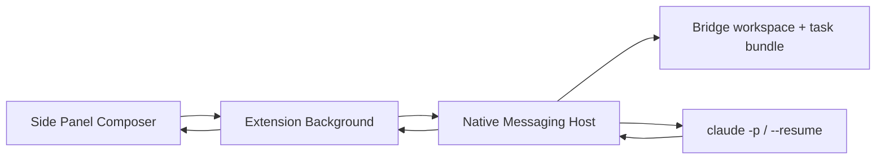

# v0.7.1 Claude Code 一键任务交接 Spec

> 日期：2026-07-19  
> 前置版本：v0.6.1 Change Contract、v0.6.2 Artifact Version Reconciliation 已完成。  
> 实施优先级：**高于原 v0.7 Codex adapter**。v0.7.1 虽然版本号在后，但应作为第一个 Local Bridge vertical slice 落地。  
> 目标：用户在 HTML Genius Side Panel 点击一次，即将当前批注的 Change Contract 自动、可验证地发送给本机 Claude Code CLI。  
> 首发平台：macOS + Chrome + Node.js 20+ + 已安装并登录的 Claude Code CLI。

## 0. 本版只解决什么

本版解决一个明确闭环：

```text
选择批注 → 生成 Change Contract → Side Panel 点击「发送给 Claude Code」
→ Native Host 启动 claude -p → Claude Code 收到任务 → 扩展显示已交接的 session
```

这不是候选 HTML 生成版，也不是文件回写版。**v0.7.1 的验收是“任务已真实到达 Claude Code CLI”，不是“Claude 已修改原文件”。**

这样拆分是必要的：先验证用户最关心的无切换交接路径、CLI 登录和 bridge-owned session 续发，再把 candidate 生成和版本回写叠加上去。把三件事一起做，出错时无法判断是 Native Messaging、Claude CLI、prompt、文件权限还是 v0.6.2 写回协议出了问题。

原 v0.7 Codex plan 中的通用 Native Host / session store 设计仍有效，但 provider 的首个实现改为 Claude Code。Codex adapter 后移，复用本版已有的 transport、状态机和存储，不另造一套 Bridge。

## 1. 产品边界

### 必须做到

1. 只使用用户机器上现有的 `claude` CLI 登录态；HTML Genius 不要求、不读取、不保存 API key、OAuth token、Cookie 或订阅凭据。
2. 本机 Native Host 以 `claude -p --output-format json` 启动一次非交互任务；不弹终端，不要求用户复制/粘贴。
3. 第一次点击为当前逻辑文档创建一个 Claude session，并把该 `session_id` 标记为 `ownership: "htmlgenius"`。
4. 以后可选择“继续 HTML Genius 上次创建的 Claude task”；只能用保存的 UUID 执行 `claude -p --resume <session_id>`。
5. 不运行 `claude -c`，不运行 `claude --resume` 的 picker/name 搜索，不运行 `claude agents`、`claude logs`、`claude attach`，不枚举或读取用户已有会话。
6. 不向正在运行的 Claude 会话注入输入。只有此前由 HTML Genius 创建、并且记录为 terminal status 的 session 才能续发。
7. 发送内容为 v0.6.1 生成的完整 Change Contract JSON + 人可读 prompt，host 写入本地 task bundle 后要求 Claude 读取；不能只传几条 comment 文本。
8. Side Panel 显示 `已发送`、失败原因或已记录 session；仍保留 Copy Prompt / Copy JSON fallback。

### 明确不做

- 不修改 source HTML、candidate HTML 或当前浏览器页面。
- 不调用 v0.6.2 `artifact-update-ready`，不 reload、不重锚定批注。
- 不做 Codex、Copilot、MCP、Claude Desktop 已打开会话或 Remote Control 接入。
- 不展示 Claude 对话、思维链、工具输出或任意用户历史会话。
- 不实现后台长任务、取消、审批转发、多任务队列、相对资源项目支持。
- 不让 Claude 执行 shell / browser / MCP / 自定义 plugin / hook；本版是任务交接验收，不是编辑执行环境。

## 2. 官方 CLI 依据

Claude Code 的官方 CLI 支持 `claude -p` 进行非交互查询后退出、`-r/--resume <session>` 续发特定 session，并提供 `--output-format json` 供程序化调用；`claude auth status` 以 JSON 返回登录状态。传入明确 session ID 时，`--resume` 只在当前项目目录及其 git worktree 中查找，因此 Bridge 必须维持稳定的项目目录。 [Claude Code CLI reference](https://code.claude.com/docs/en/cli-reference)

因此实现采用 CLI，不引入 Claude API 或 Agent SDK。后者会要求新的 package 与 API key 路径，违背“用用户已有 Claude Code”的产品边界。

## 3. 架构与目录



新增 provider-neutral `bridge/`，但本版只实现 Claude adapter：

```text
bridge/
  package.json
  host.mjs                      # Native Messaging 主程序；stdout 仅 native frames
  native-protocol.mjs           # 4-byte little-endian JSON framing
  claude-cli.mjs                # 固定 argv、auth 检查、spawn、JSON result 解析
  task-bundle.mjs               # canonical task JSON、prompt、hash 与稳定 workspace
  install-macos.mjs             # 生成/移除 Chrome Native Host manifest
  bridge-host-manifest.json.template
  test/
    fake-claude.mjs
    native-protocol.test.mjs
    claude-cli.test.mjs
    task-bundle.test.mjs
```

Bridge workspace 固定为：

```text
<source-parent>/.htmlgenius-bridge/claude/<logical-document-id>/
  task-<run-id>.json
  task-<run-id>.md
```

稳定目录是 session resume 的前提：Claude 文档说明，明确 ID 的 `--resume` 仅搜索当前项目目录和其 worktree；每次随机 cwd 会导致已记录 ID 无法可靠续发。

task bundle 是本地可审计的传输证据。文件权限必须为 `0700` 目录、`0600` 文件。不要向 `~/Library/...`、extension IndexedDB 或任何服务器复制完整 comments/prompt。

## 4. Native Host 安装与安全边界

沿用原 v0.7 plan 的 Native Messaging 方式，不用 localhost HTTP、MCP 或浏览器自动化绕过。

- Extension manifest 增加 `nativeMessaging` permission。
- host name：`com.htmlgenius.local_bridge`，不要绑定 provider 名，后续 Codex adapter 复用同一个 host。
- `npm run install:macos -- --extension-id <id>` 生成 Chrome NativeMessagingHosts manifest。
- `allowed_origins` 只允许一个 `chrome-extension://<id>/`；不可使用通配符。
- launcher 必须以绝对 Node 路径和绝对 `host.mjs` 路径执行；不允许 `sh -c`、用户传入 command 或环境变量。
- host 输入只接受定义的 JSON messages；最大 native frame 1 MiB；日志仅 stderr，stdout 只写 Native Messaging frame。

### Claude 子进程硬约束

`claude-cli.mjs` 只可使用 `spawn("claude", argv, { cwd: workspace, shell: false })`。extension 传来的内容绝不能成为 command、flag、cwd 或 env。

固定 argv（具体 flag 可按检测到的 Claude 版本做最小兼容调整，但不得放宽安全语义）：

```text
claude -p --output-format json --safe-mode --no-chrome
  --disable-slash-commands
  --tools "Read,Glob,Grep"
  --disallowed-tools "Bash" "Edit" "Write" "WebFetch" "WebSearch" "mcp__*"
  --permission-mode dontAsk
  <generated-task-prompt>
```

本版禁用 Edit/Write/Bash/网络/MCP，确保 Claude 只能读取 task bundle 并回执。Claude CLI 的 `--tools` 可限制内建 tools，`--disallowed-tools` 可禁止指定工具，`--safe-mode` 会禁用用户自定义 hooks、plugins、MCP、skills 与本地项目定制。[Claude Code CLI reference](https://code.claude.com/docs/en/cli-reference)

不使用 `--dangerously-skip-permissions`、`bypassPermissions` 或 `--add-dir`。

## 5. IndexedDB 与 session ownership

本版将 extension DB 升级为 `DB_VERSION = 3`。保留所有 v0.6.2 store，并创建以下 provider-neutral store；未来 Codex adapter 必须复用，而不是新建同义 store。

### `bridge_sessions`

`keyPath: "key"`；索引：`logical_document_id`、`provider`。

```js
{
  key: "hgd_...:claude_code_cli",
  logical_document_id: "hgd_...",
  provider: "claude_code_cli",
  ownership: "htmlgenius",
  session_id: "uuid-from-claude-json",
  workspace_path: "/absolute/.../.htmlgenius-bridge/claude/hgd_...",
  status: "completed" | "failed",
  created_at: "ISO-8601",
  updated_at: "ISO-8601"
}
```

### `bridge_runs`

`keyPath: "run_id"`；索引：`logical_document_id`、`tab_id`、`status`。

```js
{
  run_id: "hgr_...",
  logical_document_id: "hgd_...",
  tab_id: 123,
  provider: "claude_code_cli",
  session_mode: "new" | "continue",
  session_id: "uuid" | null,
  task_sha256: "sha256:...",
  source_artifact_uri: "file:///.../report.html",
  base_artifact_hash: "sha256:...",
  status: "starting" | "running" | "completed" | "failed",
  error_code: "..." | null,
  created_at: "ISO-8601",
  completed_at: "ISO-8601" | null
}
```

不在 IndexedDB 保存完整 Change Contract、prompt、Claude stdout 或模型回复。run record 只存 payload hash 与 session metadata。

新增 `Storage` API：

```js
getBridgeSession(logicalDocumentId, provider)
saveBridgeSession(record)
getActiveBridgeRunForTab(tabId)
saveBridgeRun(record)
updateBridgeRun(runId, patch)
```

所有查询只能通过 `logical_document_id + provider`；禁止 API 接收任意 `session_id` 读取/导入会话。

## 6. 任务发送协议

### 6.1 Side Panel → Background

Composer 在 `precise_patch`、`local_optimize`、`regenerate` 三种模式显示：`发送给 Claude Code`。`restructure` 继续只显示复制规划任务。

```js
{
  type: "bridge-start",
  provider: "claude_code_cli",
  tab_id: 123,
  session_mode: "new" | "continue",
  change_contract: ChangeContract.buildTask(...) // 原 schema，不改写
}
```

Side Panel 不得传入可信的 file path/hash/logical ID。Background 必须从该 `tab_id` 的 content-script 再取 `get-export`，并要求：

- `artifact.isLocal === true`；
- `artifact_state.logical_document_id`、`artifact_state.artifact_uri`、`artifact_state.loaded_artifact_hash` 存在；
- 没有当前 tab 的 starting/running run；
- `continue` 时确有 `provider === "claude_code_cli"`、`ownership === "htmlgenius"`、`status !== "running"` 的 session；
- Change Contract 的 artifact URL 与当前 tab URI 一致，root IDs 均存在于当前 non-stale annotation 集合。

不满足则在 Background 拒绝，不连接 Native Host。

### 6.2 Background → Host

```js
{
  type: "claude_handoff_start",
  run_id: "hgr_...",
  source: {
    logical_document_id: "hgd_...",
    artifact_uri: "file:///.../report.html",
    base_artifact_hash: "sha256:..."
  },
  session: {
    mode: "new" | "continue",
    session_id: "uuid" | null
  },
  task: { /* 完整 Change Contract */ }
}
```

Host response：

- `bridge_status`：`checking`、`running`；仅短状态字符串；
- `bridge_session_created`：`run_id`、`session_id`；
- `bridge_completed`：`run_id`、`session_id`、`task_sha256`；
- `bridge_failed`：`run_id`、`code`、安全的用户可读 message。

Background 对全部 response 做 `run_id`、provider、session mode、task SHA 对照。任何对照失败均不写 session、不显示成功。

## 7. Host 执行流程

1. 收到 `claude_handoff_start`，校验字段类型、SHA-256 格式、task schema version、最大大小。
2. 使用 `fileURLToPath()` 校验 source 是现有 regular `.html/.htm` 文件；读取 bytes 计算 SHA-256。与 base 不一致则 `SOURCE_CHANGED_BEFORE_START`。
3. 创建稳定 workspace 和本次 task bundle。`task-<run-id>.json` 为 `JSON.stringify(task, null, 2)`；`.md` 同时含固定安全前言与 `ChangeContract.renderPrompt(task)`。
4. `task_sha256` 以 JSON bundle 原始 UTF-8 bytes 计算。host 生成 prompt 时必须含 task JSON 的绝对路径、task hash、run ID 和 root annotation ID；不得把完整 prompt 放到 argv 以外的 shell 插值中。
5. 先执行 `claude auth status`，exit code 非 0 则 `CLAUDE_NOT_LOGGED_IN`。
6. `new`：执行固定 `claude -p ...`。解析 stdout 的单个 JSON result；结果缺少合法 UUID `session_id` 则 `CLAUDE_INVALID_RESULT`，不得创建 session record。
7. `continue`：固定 argv 加 `--resume <stored-uuid>`；cwd 必须为该 session record 的 `workspace_path`。不支持/找不到 session 返回 `CLAUDE_SESSION_UNAVAILABLE`，不尝试 `-c` 或 picker。
8. 成功后仅返回 session ID / task hash；不返回完整 Claude response。Background 持久化 run 与 session。 
9. 重新读取 source hash；若运行期间源文件发生变化，run 标为 `SOURCE_MUTATED_DURING_HANDOFF`。由于本版 Claude 没有文件编辑权限，这通常意味着用户或其他进程修改；仍不把它称为成功的 artifact 版本。

### 给 Claude 的固定 prompt

```text
You are receiving an HTML Genius Change Contract for acknowledgement only.
Read the task bundle at: <absolute path>
Verify its SHA-256 is: <task_sha256>.
Do not modify any file. Do not run shell commands, use the browser, network, MCP, plugins, or ask for credentials.
Reply with a concise acknowledgement of the task mode and the root annotation IDs you received.
```

这个 prompt 的目的是验证 comments 修改计划完整到达 CLI，而不是让模型现在开始改页面。真正执行编辑时会在后续 candidate-execution 版本替换为受控写入 prompt。

## 8. Side Panel UI

### Composer

- 仅满足本地 artifact 条件时显示 `发送给 Claude Code`。
- 有当前文档 Bridge-owned Claude session 时，显示选择：`创建新的 Claude task`（默认） / `继续 HTML Genius 上次创建的 Claude task`。
- 不出现 session ID 输入、会话列表、会话搜索或“连接当前 Claude 会话”。
- 点击后按钮 disabled，并显示 `正在发送给本机 Claude Code…`。
- 成功：`修改计划已发送给 Claude Code。` 可附本地任务编号，不展示 session UUID 作为用户操作入口。
- Bridge 未安装：`未检测到本地 Bridge。安装后可一键发送；你仍可复制任务。`
- 未登录：`Claude Code 未登录。请在终端运行 claude auth login 后重试。`
- 其他失败：显示短错误与“复制任务” fallback。

中/英/日必须覆盖。不能在 `sidepanel.js` 写硬编码中文。

## 9. 实施步骤

1. 新增 Native Messaging host / macOS installer / frame codec，并用 fake host 验证 extension → host 往返。
2. 在 `storage.js` 升级 DB v3，实现 `bridge_sessions` 与 `bridge_runs`；先做 migration/单测。
3. 实现 `task-bundle.mjs`：canonical JSON、SHA-256、stable workspace、0600/0700 权限。
4. 实现 `claude-cli.mjs`：`auth status`、固定 spawn argv、stdout JSON parse、session UUID validation、timeout（3 分钟）、stderr 截断（8 KiB）。
5. 实现 `background.js` gateway：tab lock、host port、double validation、run/session 持久化。Content-script 只提供当前 artifact state，不添加写回逻辑。
6. 修改 Composer UI 和 i18n；保留 v0.6.1 Copy Prompt/JSON 行为。
7. 增加 `docs/LOCAL_BRIDGE.md` 的 Claude Code 安装/登录/extension-id/installer/卸载/诊断章节。
8. 最后进行真实 macOS Chrome e2e；未通过不可更新 README 对外宣称支持 Claude。

## 10. 文件范围

允许：

- `extension/manifest.json`
- `extension/background.js`
- `extension/storage.js`
- `extension/sidepanel.html`
- `extension/sidepanel.css`
- `extension/sidepanel.js`
- `extension/i18n.js`
- 新增 `bridge/`
- 新增必要 tests / `docs/LOCAL_BRIDGE.md`

禁止：

- `extension/change-contract.js` 的 task schema 与四种契约语义；
- `extension/content-script.js` 的 artifact 写回/锚点流程（本版只读当前 state）；
- `extension/text-quote.js`、`undo.js`、元素编辑；
- server、协同、登录、远端 API；
- 原 v0.6.2 文件版本机制；
- Codex adapter、candidate writer、原文件覆盖、MCP。

## 11. 验收

### 自动测试

1. Native frame：拆包、粘包、非法 JSON、超 1 MiB，stdout 无日志污染。
2. task bundle：同一 task 得到稳定 SHA；包含顶层 annotations、回复树、mode、preserve、brief；权限为 0600/0700。
3. fake Claude new run：host 固定 argv 带 `-p --output-format json` 与 task bundle path；fake CLI 收到内容并返回 UUID，session/run 正确保存。
4. fake Claude continue：只使用保存的 UUID 和同一 workspace；未保存 ID、running session、错误 ID 均拒绝，绝不调用 `-c`。
5. argv injection：comment、brief、artifact path 含引号、换行、`;`、`$()` 时仍只是 JSON/task 内容，不能改变子进程 argv。
6. auth fail、stdout 非 JSON、无 session ID、timeout、source hash 不一致均得到正确失败，不写 session success。
7. 现有 v0.6.1 Change Contract / v0.6.2 artifact test 全部 PASS。

### 真实手工 e2e

1. 在本机完成 `claude auth login`，安装 host，reload extension。
2. 打开一个 local HTML，创建至少两条批注和一条回复，选择 `精准修补`，点击 `发送给 Claude Code`。
3. Side Panel 无需切换应用即显示发送中→成功；Native Host task JSON 内含两条批注、回复、selector、preserve、contract；Claude CLI result 返回新 session ID。
4. 再创建一条批注，选择继续；host 必须用同一个 session UUID + 同一 workspace 调用 `--resume`，不调用 `-c`。
5. 另开一个正常 Claude CLI 会话；HTML Genius UI 不显示它，不能选择它，也不会向它发送任何内容。
6. source HTML 在点击前被改动时，host 拒绝发送；点击后被外部改动时，run 标记冲突，页面不 reload。
7. `restructure` 模式没有发送按钮，只能复制规划任务。

## 12. 下一步

v0.7.1 完成后，下一步不是立刻覆盖 source，而是 v0.7.2（或重新编号后的 candidate-execution milestone）：把已验证的 Claude adapter 从“只读 task acknowledgement”升级为“写受控 candidate artifact”，接到 v0.6.2 的 `new_artifact` completion。之后才评估 diff/review/promote 和 Codex adapter。
